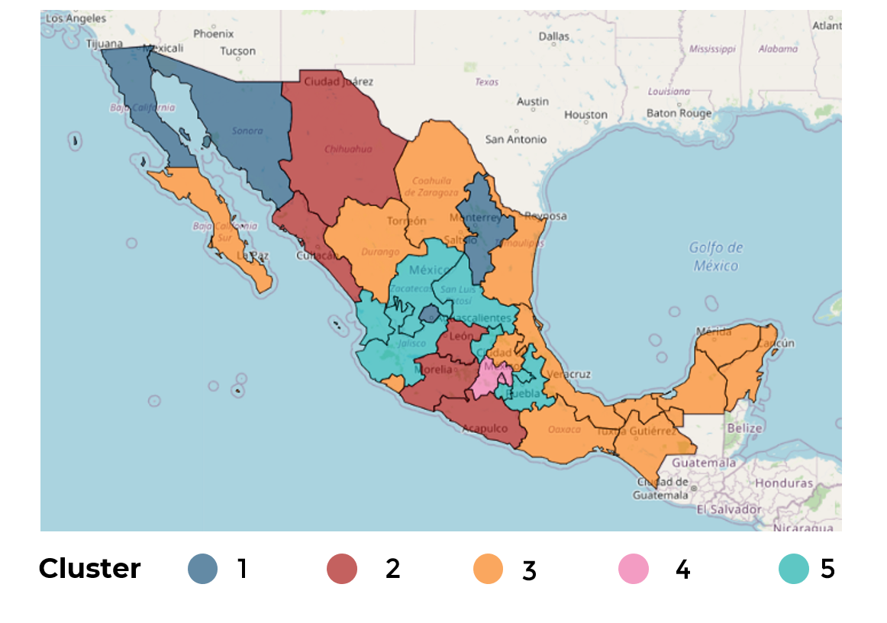

# Analysis of crimes in Mexico during 2017 with Machine Learning techniques (Cluster Analysis): Comparison Elbow Method and Silhouette Method
_Camacho-Perez Enrique, Arroyo-Velázquez Isaac_

## Description
During the elective course of "Data Science" taught by Prof. Enrique Camacho at the Faculty of Engineering UADY, we performed a task to understand and practice the K-Means algorithm (an unsupervised learning algorithm) and the selection of optimal number of clusters with the help of the **Elbow Method**. In this repository we go a little deeper than usual in class and compare it against another algorithm for selecting the optimal number of clusters called the **Silhouette Method.**

## Medium
The analysis and procedure are documented in the _Jupyter Notebook_ named **ClusterAnalysis_CrimesMexico2017_en.ipynb** and in the following Medium's article:

## Software Requirements:
* Python +3.7
* The following libraries:
  * NumPy: `pip install numpy`
  * Pandas: `pip install pandas`
  * Sci-kit Learn: `pip install scikit-learn`
  * Folium: `pip install folium`
  * Seaborn: `pip install seaborn`

## Contact
* [**Isaac Arroyo**](https://www.linkedin.com/in/isaac-arroyo/):
  * e-mail: isaacarroyov@outlook.com
* [**Enrique Camacho**](https://www.linkedin.com/in/ekamacho/):
  * e-mail: enrique.camacho@gmail.com
  * [GitHub](https://github.com/enriquecamacho)
